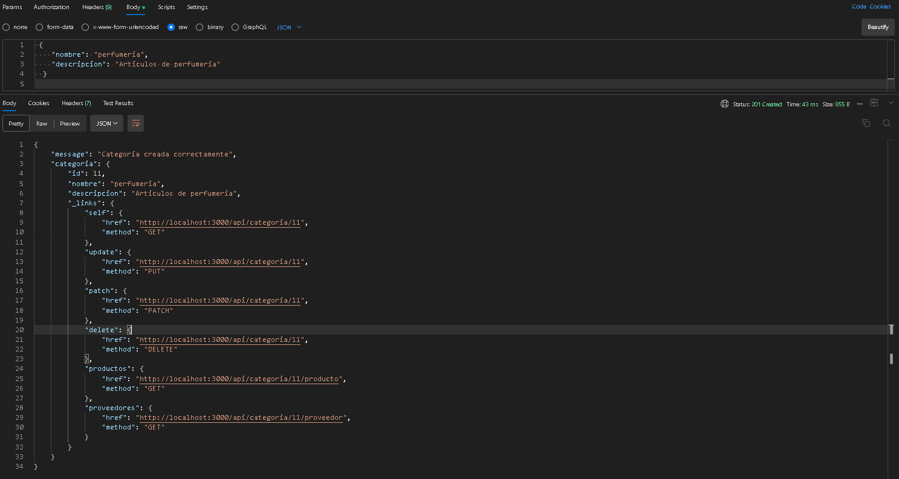
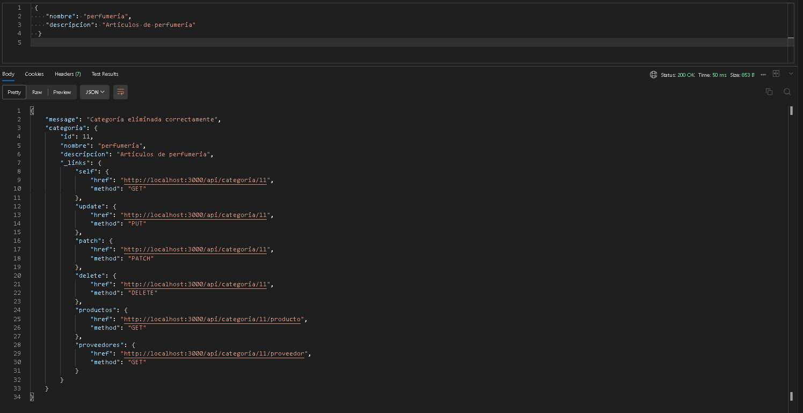

# API Control de Stock

API REST desarrollada en **Node.js + Express** para la **gestión de productos, proveedores y categorías**.  
Permite realizar operaciones CRUD completas y consultas adicionales para el control del inventario.

---

## Objetivo del proyecto
Brindar una API modular y extensible para el manejo de stock y relaciones entre productos, categorías y proveedores, simulando una base de datos mediante archivos JSON.

---

## Tecnologías utilizadas
- Node.js 
- Express.js
- ES Modules (import/export)
- Nodemon 
- JSON como base de datos local

---

## Instrucciones para build y ejecución

### 1️⃣ Clonar el repositorio
```bash
git clone https://github.com/almipo/apiControlStock.git
cd apiControlStock
```
### 2️⃣ Instalar dependencias
```
npm install
```
### 3️⃣ Ejecutar el servidor en modo desarrollo
```
npm run dev
El servidor se inicia por defecto en http://localhost:3000
```

## 📂 Estructura del proyecto

```
src/
 ├── controllers/
 │   ├── producto.controller.js
 │   ├── proveedor.controller.js
 │   └── categoria.controller.js
 │
 ├── services/
 │   ├── producto.service.js
 │   ├── proveedor.service.js
 │   └── categoria.service.js
 │
 ├── dao/
 │   ├── producto.dao.js
 │   ├── proveedor.dao.js
 │   └── categoria.dao.js
 │
 ├── models/
 │   ├── producto.model.js
 │   ├── proveedor.model.js
 │   └── categoria.model.js
 │
 ├── data/
 │   ├── productos.json
 │   ├── proveedores.json
 │   └── categorias.json
 │
 ├── routes/
 │   ├── producto.routes.js
 │   ├── proveedor.routes.js
 │   └── categoria.routes.js
 │
 └── server.js
 ```


## 🔹 Endpoints disponibles
### 🧩 Productos
```
Método     Endpoint                    Descripción
GET    /api/producto	                Listar todos los productos
GET    /api/producto/:id	            Obtener un producto por su ID 
GET    /api/producto/:id/categoria      Obtener informacion de la categoria del producto 
GET    /api/producto/:id/proveedor      Obtener informacion del proveedor del producto

POST   /api/producto	                Crear un nuevo producto

PUT    /api/producto/:id	            Actualizar totalmente un producto

PATCH  /api/producto/:id	            Actualizar parcialmente un producto

DELETE /api/producto/:id	            Eliminar un producto

POST   /api/producto/movimiento	        Registrar entrada o salida de stock 
```

### 👷 Proveedores
```
Método	  Endpoint                        Descripción
GET    /api/proveedor	                 Listar todos los proveedores 
GET    /api/proveedor/:id	             Obtener un proveedor por ID 
GET    /api/proveedor/:id/productos	     Listar productos asociados a un proveedor 
GET    /api/proveedor/:id/categorias	 Listar categorías relacionadas al proveedor

POST   /api/proveedor	                 Crear un nuevo proveedor 

PUT    /api/proveedor/:id	              Actualizar totalmente proveedor 

PATCH  /api/proveedor/:id	              Actualizar parcialmente proveedor  
DELETE /api/proveedor/:id	              Eliminar proveedor 
```

### 🗂 Categorías
```
Métod    Endpoint                          Descripción
GET     /api/categoria                    Listar todas las categorías 
GET     /api/categoria/:id	              Obtener categoría por ID 
GET     /api/categoria/:id/productos	  Obtener productos de una categoría 
GET     /api/categoria/:id/proveedores	  Obtener proveedores asociados a una categoría 

POST    /api/categoria	                  Crear nueva categoría 

PUT     /api/categoria/:id	              Actualizar totalmente categoría 

PATCH   /api/categoria/:id	              Actualizar parcialmenr categoría 

DELETE  /api/categoria/:id	              Eliminar categoría 
```
---

## Casos de prueba (Postman)


A continuación se muestran pruebas ejecutadas en Postman.

| Caso | Captura |
|------|---------|
| Listar producto 2 (GET /api/producto/2) |  |
| Listar proveedor del producto 2  (GET /api/producto/2/proveedor) |  |
| Listar Productos del proveedor 2 (GET /api/proveedor/2/producto) |  |
| Modificar proveedor 2 (PATCH /api/proveedor/2) |  |
| Crear categoria (POST /api/categoria) |  |
| Borrar categoria (PATCH /api/proveedores/:id) |  |

